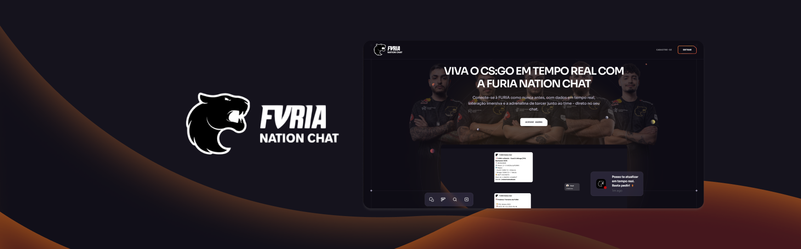

<div align="center">
  <br />
      
  <br />

  <div>
    
    
    
  </div>

  <h1 align="center">FURIA Nation Chat</h1>

   <div align="center">
     <pre><i>Sua Landing Page Exclusiva do Chatbot FURIA Nation.</i></pre>
    </div>
</div>


## <a name="visaogeral">🤖 Visão Geral</a>

Este projeto visa ser a porta de entrada para criação de um espaço de interação digital vibrante e completo para os fãs do time de CS:GO da FURIA Esports. Inspirado no desejo de um fã, a FURIA Nation Chat vai além da simples troca de mensagens, oferecendo uma experiência imersiva e informativa para acompanhar o time.

## <a name="tech-stack">⚙️ Tech Stack</a>

- Vite
- React.js
- Tailwind CSS

## 🚀 Como Executar

Garanta que tenha instalado em sua máquina as seguintes dependências:

- [Git](https://git-scm.com/)
- [Node.js](https://nodejs.org/en)
- [npm](https://www.npmjs.com/) (Node Package Manager)

### Instalação

#### 1. **Clone o repositório:**
   ```bash
   git clone https://github.com/anaperinii/furia-nation-chat
   cd furiabot
   ```

#### 2. **Instale as dependências do projeto:**
   ```bash
   npm install
   ```

#### 3. **Execute o projeto:**
   ```bash
   npm run dev
   ```

Abra [http://localhost:5173](http://localhost:5173) em seu navegador para visualizar o projeto.


